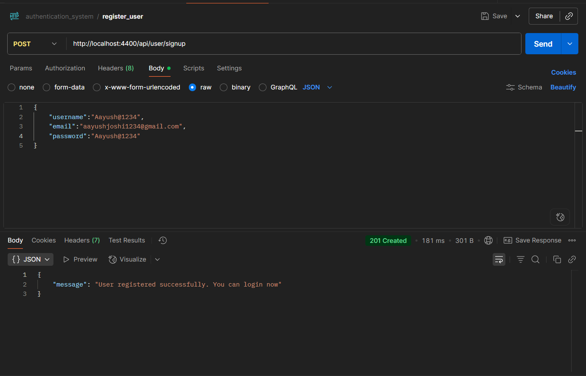
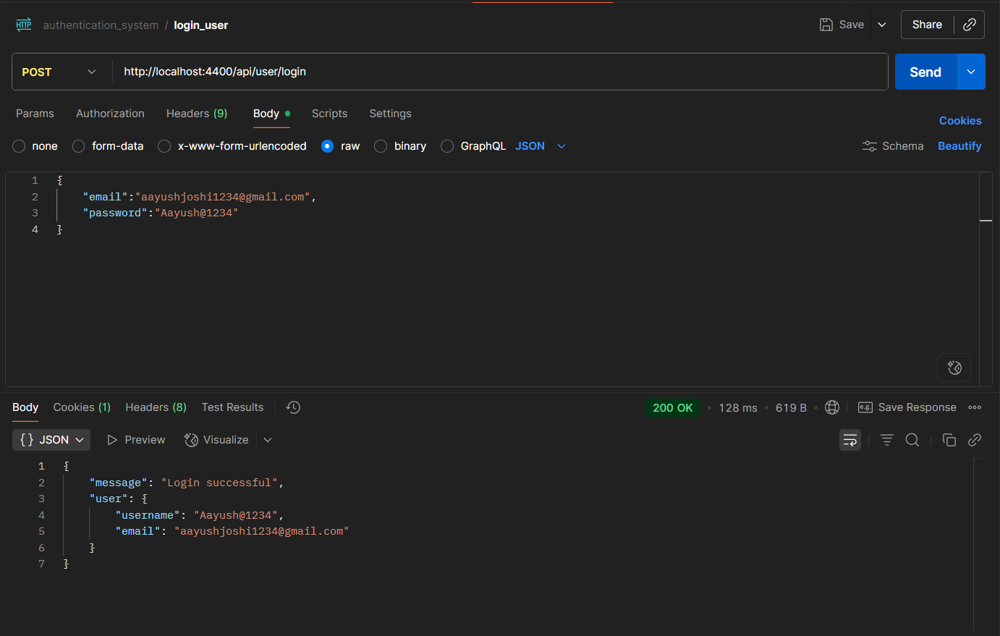
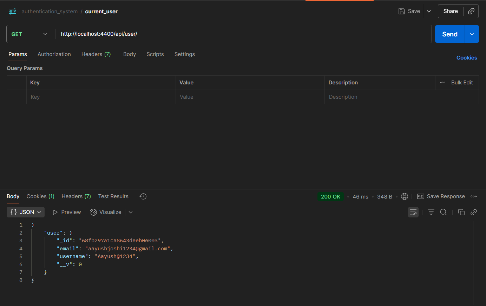
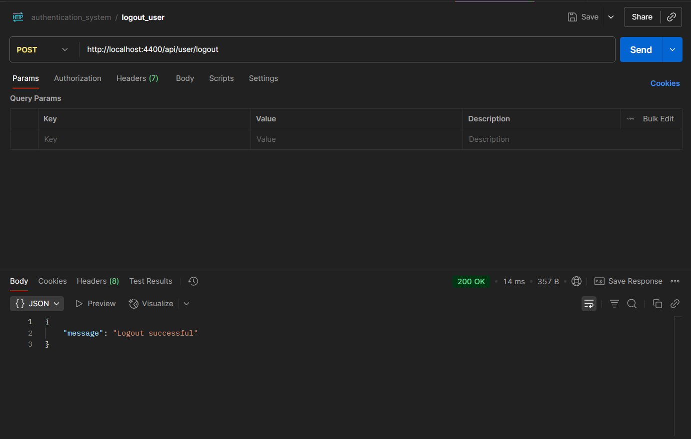

# Authentication System Application

This is a simple user authentication system built using Node.js, Express, MongoDB, and JWT.  
It allows users to register, login, get their profile, and logout. Passwords are securely hashed using bcrypt and JWT tokens are used for authentication.

## Features

- User registration with username, email, and password
- User login with email and password
- Secure password hashing
- JWT based authentication
- Get current logged in user
- Logout user
- Protect routes using middleware

## Technologies Used

- Node.js
- Express.js
- MongoDB with Mongoose
- bcrypt for password hashing
- JSON Web Tokens for authentication
- dotenv for environment variables
- cookie-parser for storing tokens in cookies

## API Routes

### Register User

- **Route:** POST /api/user/signup  
- **Description:** Register a new user  
- **Request Body:** username, email, password  
- **Response:** Success message

### Login User

- **Route:** POST /api/user/login  
- **Description:** Login user and get authentication token  
- **Request Body:** email, password  
- **Response:** User info and token stored in cookie

### Get Current User

- **Route:** GET /api/user/  
- **Description:** Get the current logged in user  
- **Headers:** Requires authentication cookie  
- **Response:** User object

### Logout User

- **Route:** POST /api/user/logout  
- **Description:** Logout the user and clear cookie  
- **Response:** Success message

## Installation

1. Clone the repository  
2. Install dependencies using `npm install`  
3. Create a `.env` file and add your `MONGO_URI`, `PORT`, `NODE_ENV` and `JWT_SECRET`  
4. Start the server using `npm start`  

## Usage

- Use a tool like Postman to test the API routes  
- Use the authentication token stored in cookies for protected routes

## License

This project is for learning purposes
